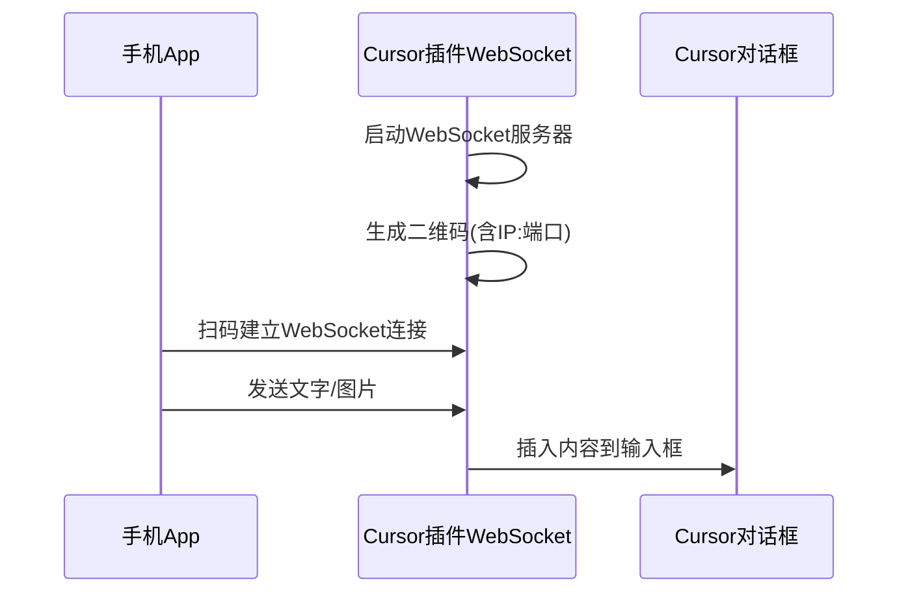

# Voice to Cursor - 手机端输入实时同步工具

## 整体架构




## 项目结构

```
voice-to-cursor/
├── extension/          # Cursor/VSCode 插件
│   ├── src/
│   │   ├── extension.ts      # 插件入口
│   │   ├── server.ts         # WebSocket 服务器
│   │   ├── qrcode.ts         # 二维码生成
│   │   └── inputHandler.ts   # 输入框内容插入
│   └── package.json
│
└── mobile-app/         # React Native App
    ├── app/
    │   ├── index.tsx         # 扫码页面
    │   └── input.tsx         # 输入页面
    ├── services/
    │   └── websocket.ts      # WebSocket 客户端
    └── package.json
```

---

## Part 1: Cursor 插件

### 1.1 核心功能

- **启动 WebSocket 服务器**：监听局域网连接
- **生成二维码**：包含 `ws://192.168.x.x:port` 地址
- **接收消息**：文字直接插入，图片转为 Base64 后插入
- **内容插入**：使用 VSCode API 将内容写入活动编辑器或剪贴板

### 1.2 关键代码逻辑

```typescript
// extension.ts - 插件入口
import * as vscode from 'vscode';
import { WebSocketServer } from 'ws';
import { getLocalIP } from './utils';

export function activate(context: vscode.ExtensionContext) {
  // 注册命令：启动服务
  const startCommand = vscode.commands.registerCommand(
    'voiceToCursor.start',
    () => {
      const ip = getLocalIP();
      const port = 9527;
      const wss = new WebSocketServer({ port });
      
      // 显示二维码 WebView
      showQRCodePanel(`ws://${ip}:${port}`);
      
      wss.on('connection', (ws) => {
        ws.on('message', (data) => {
          const msg = JSON.parse(data.toString());
          if (msg.type === 'text') {
            insertToActiveEditor(msg.content);
          } else if (msg.type === 'image') {
            insertImageToActiveEditor(msg.base64);
          }
        });
      });
    }
  );
}
```

### 1.3 内容插入策略（三层降级）

由于 Cursor 对话框不是标准 VSCode 编辑器，采用三层降级方案：


| 优先级 | 方案         | 实现方式                                                | 说明              |
| --- | ---------- | --------------------------------------------------- | --------------- |
| 1   | 剪贴板 + 自动粘贴 | `clipboard.writeText()` + `executeCommand('paste')` | 优先尝试            |
| 2   | 系统级模拟输入    | macOS AppleScript 模拟 Cmd+V                          | 如果方案1对Chat无效    |
| 3   | 写入文件       | 写入 `.cursor/voice-input.md`                         | 兜底方案，用户可 `@` 引用 |


```typescript
// 三层降级逻辑
async function insertContent(content: string) {
  // 写入剪贴板
  await vscode.env.clipboard.writeText(content);
  
  // 方案1：尝试自动粘贴
  try {
    await vscode.commands.executeCommand('editor.action.clipboardPasteAction');
    return;
  } catch {}
  
  // 方案2：系统级模拟 (macOS)
  if (process.platform === 'darwin') {
    exec(`osascript -e 'tell application "System Events" to keystroke "v" using command down'`);
    return;
  }
  
  // 方案3：写入文件
  const filePath = path.join(workspaceRoot, '.cursor', 'voice-input.md');
  fs.writeFileSync(filePath, content);
  vscode.window.showInformationMessage('内容已写入 .cursor/voice-input.md，可使用 @ 引用');
}
```

**文件写入格式**（方案3）：

```markdown
<!-- Voice Input - 2026-02-03 15:30:00 -->
用户输入的内容...

<!-- 图片会以本地路径形式保存 -->

```

---

## Part 2: 手机 App (Expo/React Native)

### 2.1 核心功能

- **扫码连接**：使用 `expo-camera` 扫描二维码
- **输入界面**：支持文字输入（包括语音输入法）和图片选择
- **实时发送**：通过 WebSocket 发送内容
- **状态显示**：连接状态、发送状态

### 2.2 页面设计

**页面 1: 扫码连接页**

- 相机扫描区域
- 手动输入地址选项
- 连接状态指示

**页面 2: 输入页**

- 文本输入框（支持多行）
- 图片选择按钮
- 已选图片预览
- 发送按钮
- 连接状态指示器

### 2.3 关键代码逻辑

```typescript
// websocket.ts - WebSocket 服务
class WebSocketService {
  private ws: WebSocket | null = null;
  
  connect(url: string) {
    this.ws = new WebSocket(url);
    this.ws.onopen = () => console.log('Connected');
    this.ws.onclose = () => console.log('Disconnected');
  }
  
  sendText(content: string) {
    this.ws?.send(JSON.stringify({ type: 'text', content }));
  }
  
  sendImage(base64: string) {
    this.ws?.send(JSON.stringify({ type: 'image', base64 }));
  }
}
```

---

## Part 3: 通信协议

### 消息格式

```typescript
// 文字消息
{
  type: 'text',
  content: string,
  timestamp: number
}

// 图片消息
{
  type: 'image',
  base64: string,      // Base64 编码的图片数据
  mimeType: string,    // 'image/png' | 'image/jpeg'
  timestamp: number
}

// 状态消息
{
  type: 'status',
  status: 'connected' | 'typing' | 'idle'
}
```

---

## 技术依赖

### Cursor 插件

- `ws` - WebSocket 服务器
- `qrcode` - 二维码生成
- `os` - 获取本机 IP

### 手机 App

- `expo` - 框架
- `expo-camera` - 扫码
- `expo-image-picker` - 图片选择
- `react-native-websocket` 或原生 WebSocket

---

## 注意事项

1. **网络环境**：手机和电脑必须在同一局域网
2. **防火墙**：确保端口未被防火墙阻止
3. **图片大小**：大图片需要压缩后传输
4. **断线重连**：需要处理网络断开后的重连逻辑
5. **安全性**：可考虑添加简单的配对码验证

